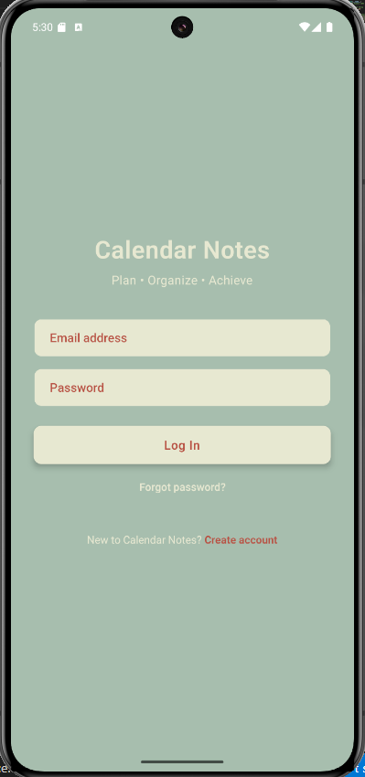
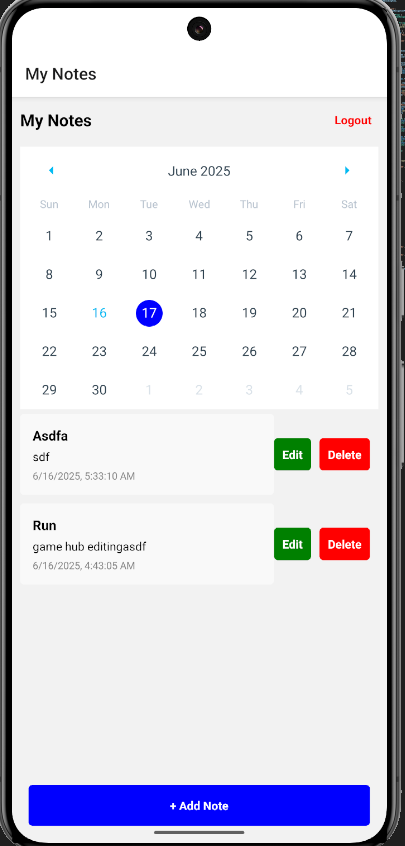
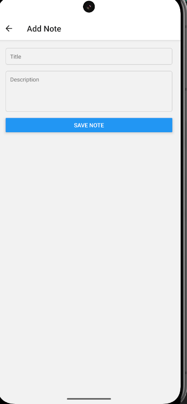
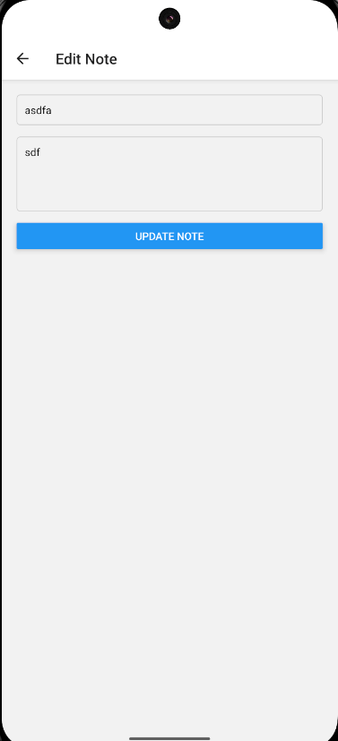

# Calendar App 📝



A mobile app for managing notes with date filtering capabilities, built with React Native (frontend) and Python Flask/FastAPI (backend).

## ✨ Features
- **Create, view & delete notes**
- **calendar App** for date filtering notes
- Cross-platform (iOS & Android)

## 🛠 Tech Stack
| Frontend              | Backend               |
|-----------------------|-----------------------|
| React Native          | Python (Flask)|
| React Navigation      | SQLite

## 🚀 Quick Start

### Prerequisites
- Node.js ≥16 + npm/yarn
- Python ≥3.9
- React Native CLI
- Xcode/Android Studio

### 1. Frontend Setup
```bash
git clone https://github.com/Muhammad-Ammad/CalendarApp.git

# Install dependencies
npm install

# Start Metro server
npx start

# Run on Android/iOS
npm run-android
# or
npx react-native run-ios

####################  ScreenShots  ##########

    

##################### 2. Backend Setup ####################

cd backend

# Create virtual env
python -m venv venv
source venv/bin/activate  # Windows: venv\Scripts\activate

# Install requirements
pip install -r requirements.txt

# Run server (Flask example)
python app.py